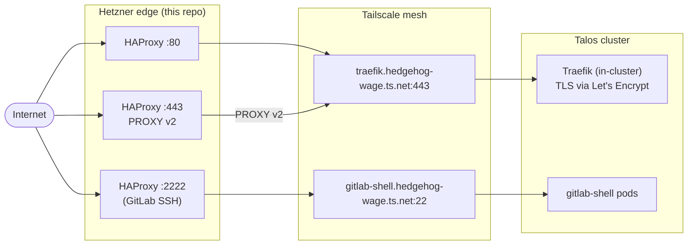

# sharkshere-ansible

Host hardening + edge service deployment for the sharkshere platform — Ansible roles that take a fresh Debian 13 jump host from `tofu apply` to a hardened TCP load-balancer terminating public traffic and tunneling it into a private Tailscale mesh.

This is the middle layer of a three-repo platform:

| Repo | Layer | Responsibility |
|---|---|---|
| [`jumpingsharks`](https://github.com/Yornik/jumpingsharks) | infrastructure | provisions Hetzner edge hosts + DNS/rDNS via OpenTofu |
| `sharkshere-ansible` (this repo) | hosts | hardens edge hosts, deploys HAProxy + Tailscale + fail2ban |
| [`sharkshere-gitops`](https://github.com/Yornik/sharkshere-gitops) | workloads | reconciles ~40 ArgoCD Applications behind that edge |

## Managed hosts

| Host | Location | Type | Role |
|------|----------|------|------|
| `jump-eu-central` | Nuremberg (`nbg1`) | Hetzner `CX23` | edge L4 load balancer + Tailscale node |
| `jump-eu-north` | Helsinki (`hel1`) | Hetzner `CX23` | edge L4 load balancer + Tailscale node |

Both publish under the same `jump.fedishark.eu` round-robin A/AAAA, fronting the cluster from two geographically separate POPs.

## Traffic flow



HAProxy runs L4 TCP only — TLS terminates inside the cluster at Traefik, which sees real client IPs via the **PROXY protocol v2** marker HAProxy injects on the HTTPS backend.

## HAProxy frontends

| Bind | Mode | Backend | Notes |
|---|---|---|---|
| `:80` | TCP | `traefik.hedgehog-wage.ts.net:80` | HTTP, used for ACME HTTP-01 challenge + HTTP→HTTPS redirect at Traefik |
| `:443` | TCP | `traefik.hedgehog-wage.ts.net:443` | `send-proxy-v2` so Traefik sees real client IPs |
| `:2222` | TCP | `gitlab-shell.hedgehog-wage.ts.net:22` | GitLab SSH (`:2222` so jump-host sshd keeps `:22`); `init-addr last,libc,none` so haproxy boots even when the Tailscale MagicDNS name isn't yet resolvable |

## Roles

Run in order from `playbooks/site.yml`:

| Role | Responsibility |
|------|----------------|
| `base` | package updates, baseline packages (`python3`, etc.), timezone, unattended-upgrades |
| `ssh_hardening` | key-only auth, stricter SSH posture, disable root login |
| `fail2ban` | brute-force protection on host sshd (separate from any Traefik-level middleware in the cluster) |
| `tailscale` | upstream apt repo + tailnet authentication via SOPS-encrypted auth key |
| `haproxy` | install + render `haproxy.cfg.j2` with config validation via `haproxy -c -f %s` before reload |

## Engineering highlights

- **Idempotent and role-scoped.** Every run is safe to re-execute; roles fail fast on unexpected state rather than papering over drift.
- **Security defaults are baseline, not a checklist.** SSH hardening, fail2ban, and unattended-upgrades happen on first boot before any workload reaches the host.
- **PROXY protocol v2 end-to-end** preserves real client IPs from the edge into the cluster. Rate-limiting, audit logs, and Vaultwarden/GitLab auth flows all see the real origin IP — not the Tailscale tunnel IP.
- **Tailscale tagged-device auth** via `tailscale_auth_key` from SOPS — no interactive login in the apt-installed runtime, no token rotation drift between hosts.
- **Config validation pre-reload.** The HAProxy template task uses Ansible's `validate:` option to run `haproxy -c -f <tempfile>` against the *new* config before it's installed; a syntax error in `haproxy.cfg.j2` fails the play instead of taking the edge offline on `systemctl reload`.
- **PR-gated.** `yamllint` + `ansible-lint` + `ansible-playbook --syntax-check` run before merge.

## Prerequisites

- Ansible (>= 2.16)
- SSH key access to jump hosts (the `ansible` user is created by `playbooks/bootstrap.yml` on first run as root)
- SOPS + age key at `~/.config/sops/age/keys.txt`

Inventory is generated from OpenTofu outputs in `jumpingsharks`.

## Usage

```bash
# all hosts
ansible-playbook playbooks/site.yml

# single host
ansible-playbook playbooks/site.yml --limit jump-eu-central

# dry run with diff
ansible-playbook playbooks/site.yml --check --diff

# first-time bootstrap (creates the `ansible` user; subsequent runs use it directly)
ansible-playbook playbooks/bootstrap.yml -e ansible_user=root
```

## Secrets

Edit the SOPS-encrypted vars file (note the `.sops.yml` extension required by the `community.sops` vars plugin):

```bash
sops group_vars/jump_hosts/secrets.sops.yml
```

## CI

PR checks:

1. `yamllint`
2. `ansible-lint`
3. `ansible-playbook --syntax-check`

## Homelab constraints

This edge layer improves exposure and security posture, but it does not remove core homelab constraints:

- Single power source at the home site
- Single residential ISP uplink
- Upstream dependency on shared NAS storage for some workloads

These are explicitly accepted tradeoffs for the homelab budget/complexity envelope.
